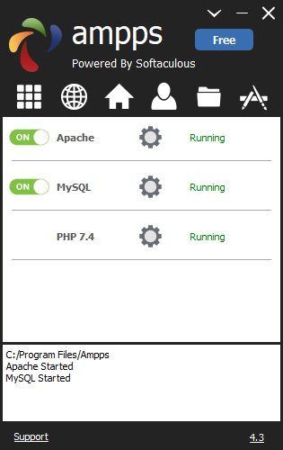
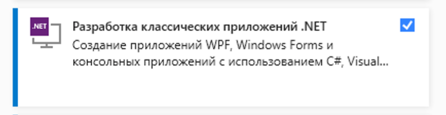

# Чек-лист по ПЗ Витомского
Создано для работы с MySQL базы данных
## Этапы выполения
- [ ] Подготовка оборудования
    - [ ] Скачать Аmpps

      После установки будет доступен следующий интерфейс

      
    - [ ] Скачать Microsoft Visual Studio
        - [ ] При установке выбрать

      
- [ ] Подготовка базы данный
    - [ ] Войти в phpMyAdmin
        - [ ] В интерфейсе ampps нажать на домик, который откроет сайт
        - [ ] На сайте нажать на кнопку phpMyAdmin
        - [ ] Войти в систему по логину `root` и паролю `mysql`
    - [ ] Создать базу данных с любым названием. Например, `mzd`.
      Можно создать следующими способами:
      - Через интерфейс
        - [ ] Слева нажать на кнопу `Создать БД`
        - [ ] В поле `Имя базы данных` ввести название базы данных 
      - Через SQL-запрос: `CREATE DATABASE ``mzd``;`
    - [ ] Создать три таблицы, связанные между собой.
      Пример таблиц
      - Таблица `users` - таблица сохраненных лиц в базе данный,
        состоящая из стоблцов: `user_id` - индефикатор пользователя в базе (`PRIMARY KEY`),
        `firstname` - имя пользователя,
        `surname` - фамилия пользователя.
      - Таблица `phones` - таблица сохраненных номеров,
        которыми владеют пользователи из таблицы `users`.
        Состоит из столбцов: `phone_id` (`PRIMARY KEY`), `phone_number`, `user`.
      - Таблица `social_networks` - таблица социальных сетей.
        Состоит из `social_network_id` (`PRIMARY KEY`), `name`, `url`.
      - Таблица `rigistrations` хранит в себе регистрации пользователей во всех соц. сетях.
      Столбцы: `rigistration_id` (PK),
      
      Можно создать таблицы данных следующими способами:
      - Через интерфейс:
        - [ ]Слева выбрать базу данных
        - [ ] В поле `Имя таблицы` ввести название и брыть необходимое количество стобов.
        - [ ] Заполнить столбы `Имя` и `Тип`. 
        Для создания PK необходимо нажать на чекбокс под `A_I`
        - [ ] Если необходимо создать зависимость
          - [ ] Зайти в структуру таблицы, перейти в вкладку `Связи`
          - [ ] В поле столбец выбрать столбец,
          который ссылается к другой базе данных
          - [ ] В поле таблица выбрать ту таблицу,
          на которую будет ссылаться столбец
          - [ ] Выбрать PK той таблицы
      - SQL запросом:
      ```
      CREATE TABLE `mzd`.`users` 
      ( `user_id` INT NOT NULL AUTO_INCREMENT , `firstname` TEXT NOT NULL , 
      `surname` TEXT NOT NULL, PRIMARY KEY (`user_id`)
      ) ENGINE = InnoDB;
      CREATE TABLE `mzd`.`phones` 
      ( `phone_id` INT NOT NULL AUTO_INCREMENT,
        `user` INT NOT NULL,
      `phone` TEXT NOT NULL, PRIMARY KEY (`phone_id`)
      ) ENGINE = InnoDB;
      ```
## FAQ
### Как выполнить SQL запрос
Сверху выбрать нажать на кнопку SQL, 
в большом текстовом поле ввести необходимый запрос
и нажиьть на кнопку `Вперёд`